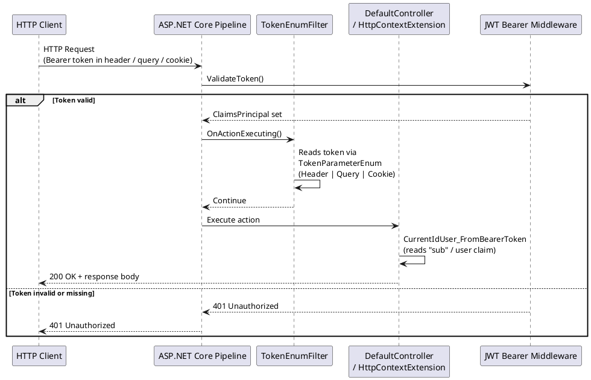
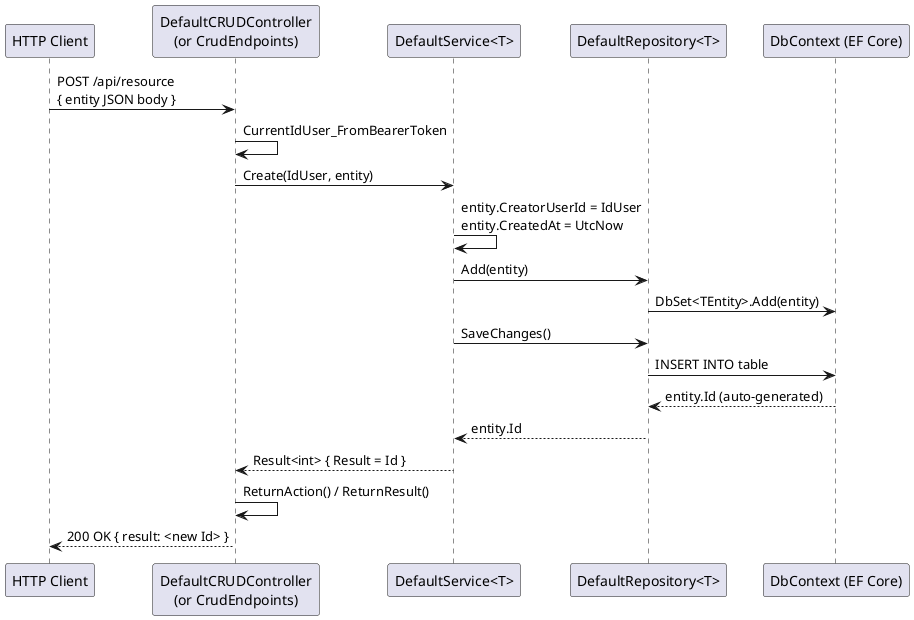
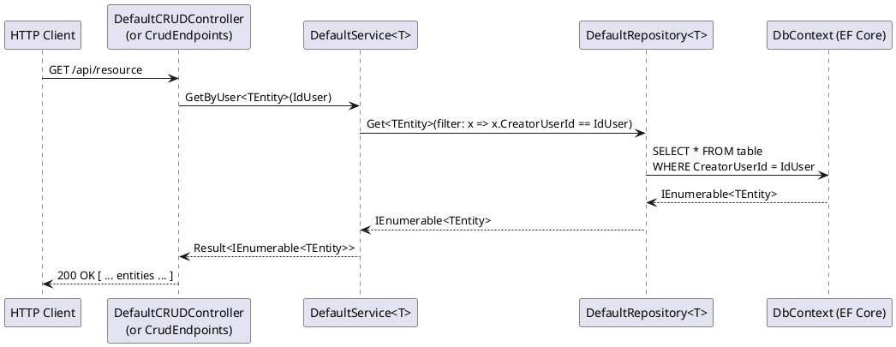
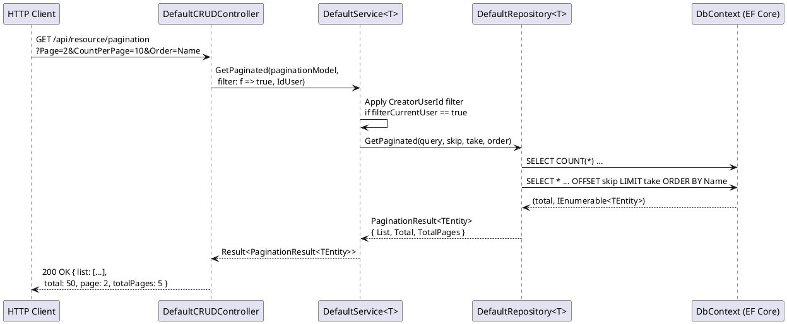
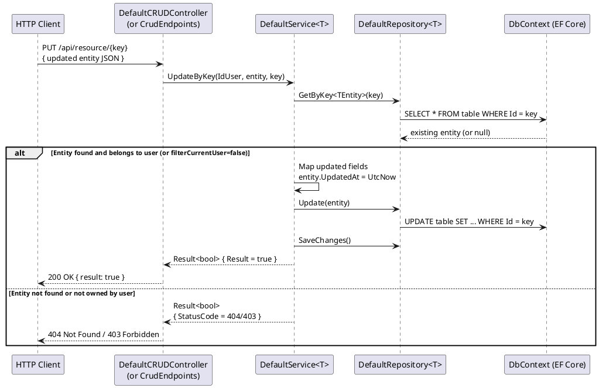
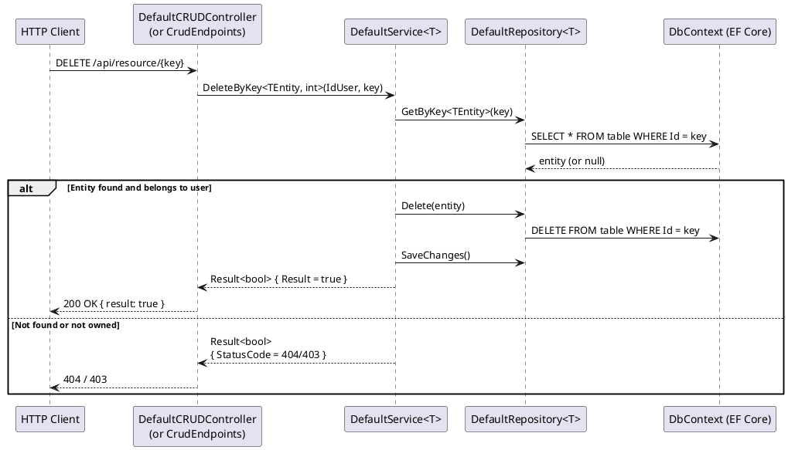
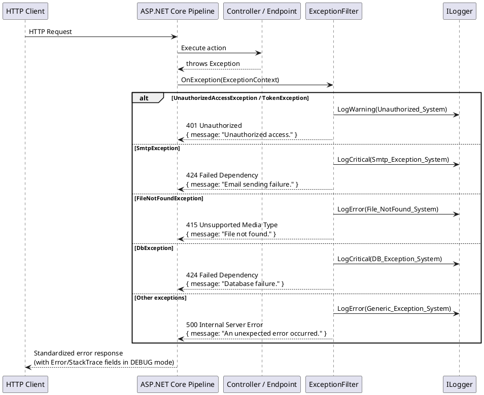
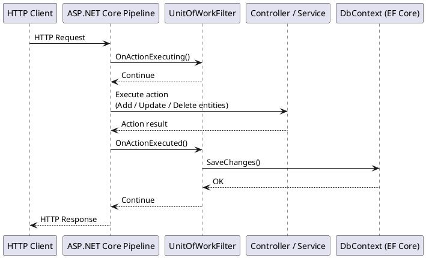

# Main Flows — jff-csharp-tools

This document describes the primary runtime flows that occur when a consumer application uses
the `jff-csharp-tools` library.

---

## 1. Request Authentication Flow

Applies to any endpoint that inherits from `DefaultController` (MVC) or uses
`HttpContextExtension.CurrentUserId()` (Minimal API).

### Step-by-step

1. Client sends an HTTP request with a Bearer JWT token.
2. ASP.NET Core JWT Bearer middleware validates the token signature and expiry.
3. `TokenEnumFilter` (when registered) validates that the token is present in the configured
   location (header, query string, or cookie).
4. `DefaultController.CurrentIdUser_FromBearerToken` reads the user ID from JWT claims.
5. All service calls use this ID for row-level filtering.

---

## 2. Create Entity Flow (POST)

---

## 3. Read Entity Flow (GET by user)

**Note:** When `filterCurrentUser = false`, the service calls `Get<TEntity>()` without the
`CreatorUserId` filter, returning all records.

---

## 4. Paginated Query Flow (GET /pagination)

---

## 5. Update Entity Flow (PUT /{key})

---

## 6. Delete Entity Flow (DELETE /{key})

---

## 7. Exception Handling Flow

Applies globally when `ExceptionFilter` is registered in the application.

---

## 8. Unit of Work Flow

When `UnitOfWorkFilter` is registered, `SaveChanges()` is called automatically after every
successful action, eliminating the need to call it manually in every service method.

